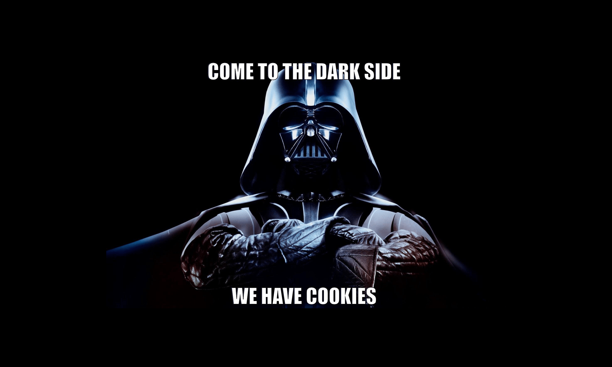

[The story of the two wolves](https://en.wikipedia.org/wiki/Two_Wolves) has been attributed to many different sources. I'll do a poor job of summarizing it by simply saying the intent is to impress upon the listener the idea is a person can be good or evil based on which nature one embraces, or feeds. In a similar vein, so too goes ownership. One path leads to the dark side...

## The Dark Side

The dark side of ownership is when someone becomes the only path to action. It might feel as if they are the only one who can get anything done. It might feel like they're a hero. It may feel like they're the only path to success. Worse, they may start to believe it. They don't want anyone else to touch the code, their code.

Actually, let me back up. This all sounds very nefarious, intentional, and dark. That's not always the case. Sometimes this person truly means well. Sometimes they may not even realize they're a problem. If you've read [The Phoenix Project](FIXME), this is Brent. He wasn't trying to be a bad guy. He wasn't trying to be a bottleneck. He meant well, but there he was. It took a fair bit of effort to unstick him and the team.

## The Other Side

Owning something takes a toll. The minimalist understands this. Choosing to own a thing should be an intentional act.

When one acts with intent in their ownership, they will try to make decisions with both the short- and long-term in mind. They will work to ensure a project can continue with or without them. This isn't a purely altruistic act. We should all be able to enjoy some time away without having to worry about the world bursting into flame due simply to our absence.

But more than the self, the project will be better for having been tended rather than protected.

## Territorialism vs Investment

Words have power. As I was thinking about how to best summarize these two kinds of ownership, I wanted to coalesce them down into single words.

A territorial creature will lash out at perceived competitors. In the wild, this can mean the difference between life and death, but in software this is rarely the case. (I feel compelled to acknowledge some work environments are more like the wild than not, but that's for another post.) Often we can benefit from the presence of others, fresh perspectives, well intentioned critiques. Having more hands working the problems and eyes on the solutions can lead to greater investment.

Investors are interested in seeing returns. They don't have to be selfless, but they are
