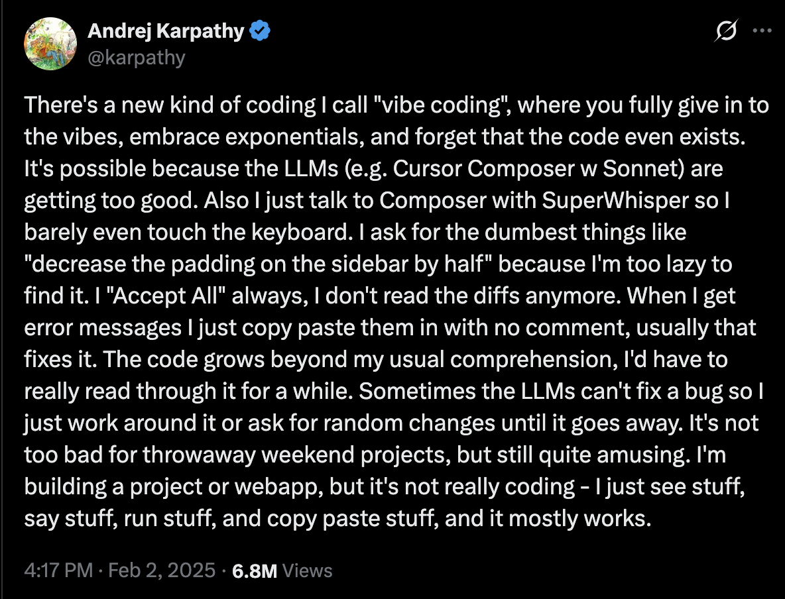

I've been a director of engineering and an architect a few times. In those roles, I was not hands-on on a regular basis, but I was still responsible for the technical outcomes of my teams. I would provide direction, allow them to make a great many decisions, and, sometimes, redirect. My teams got things done. (Thank you, teams!) I set direction, worked to ensure alignment, and then I waited to see if the agents had produced what I wanted.

Guess what. It was always vibe coding, or maybe agentic engineering. I got the very best agents I could, provided direction, sometimes correction, and adjusted outcomes as needed. Then it was people, today LLMs and agent harnesses.

Let's take a moment to define vibe coding.

For anyone who doesn't know, that's the origination. Since then it's been redefined, repurposed, recycled. 

[Agentic engineering](https://simonwillison.net/guides/agentic-engineering-patterns/what-is-agentic-engineering/) is a little different. Simon Willison says, "I use the term agentic engineering to describe the practice of developing software with the assistance of coding agents."
