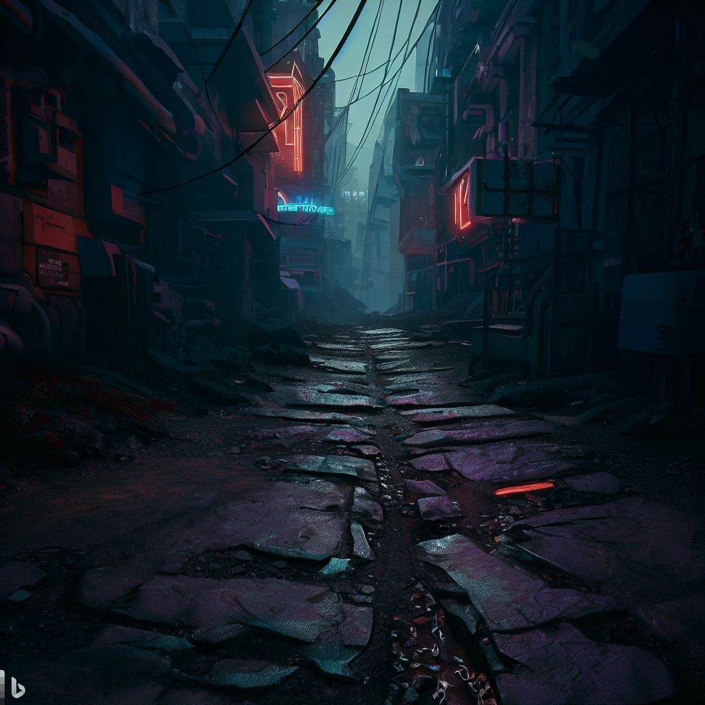

> [...]&#10;Two roads diverged in the woods, and I,&#10;I took the one less traveled by,&#10;And that has made all the difference. &mdash;  Robert Frost

Recently, I was reflecting on how I've been approaching learning new tech. It's definitely changed over the years.

I like taking the unpaved road.

